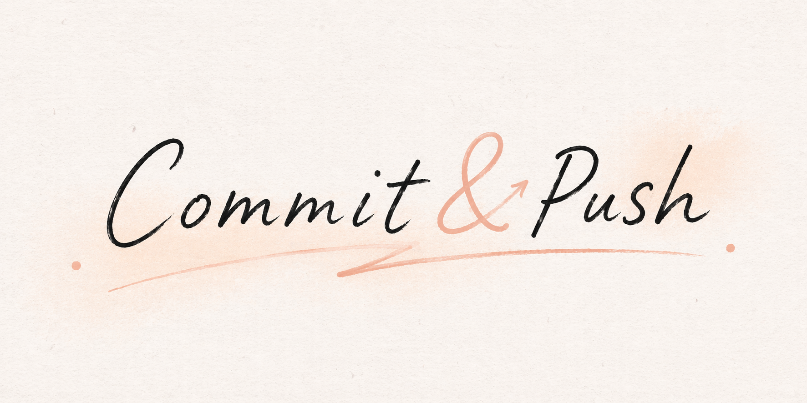

   
  <em>Commit & Push — 收藏补全计划</em>

## About

本仓库是我持续记录学习过程的地方。

之前我会收藏很多项目和别人推荐的知识内容，但大多数时候它们只是在收藏夹里吃灰，而不是被整理、理解和内化成我自己的知识。

这个项目就是想改变这种状态：不再停留在“先存着，之后再说”，而是从现在开始真正去接触、记录和推进。

> 收藏不是结束，补全才算开始。

## What Makes It Different

这个仓库不想只是做知识的搬运和摘抄。 
 
比起复制别人的结论，我更想把自己的见解、挣扎、反思和成长真实地留下来。

## What It Records

这个项目主要记录三类东西：

- 每天的学习推进
- 具体的笔记和待补全内容
- 每周的复盘与反思

## Structure

- `Milestones/`：每天的学习记录
- `Notes/`：笔记与待补全内容
- `Review/`：每周复盘 / 专题反思
- `Assets/`：图片素材
- `Templates/`：常用模板

---

## Current Status

目前这个仓库还在慢慢搭建和完善。  
现阶段的重点不是把它做得很花，而是先把记录习惯建立起来。

## Next

- 持续写 daily milestones
- 补全真正值得留下来的 notes
- 保持 weekly review
- 让这个仓库慢慢积累成自己的学习轨迹
